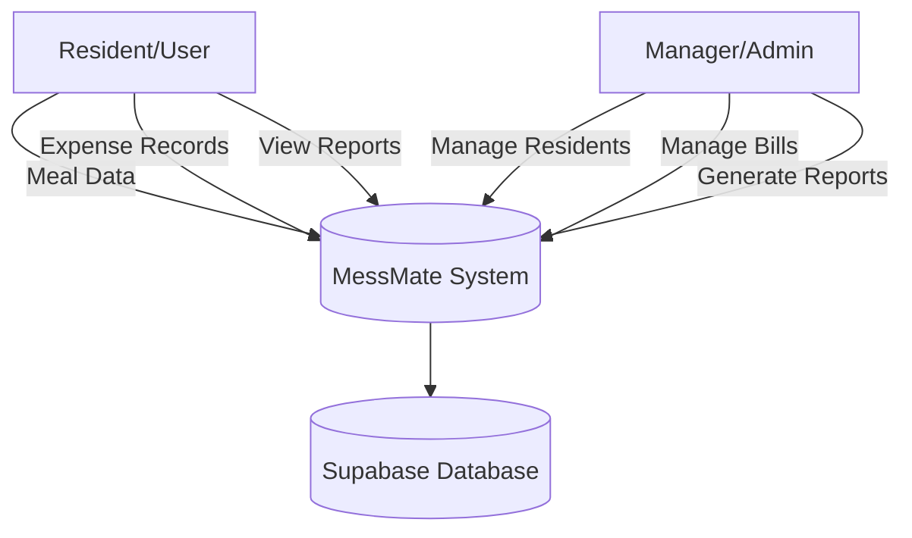
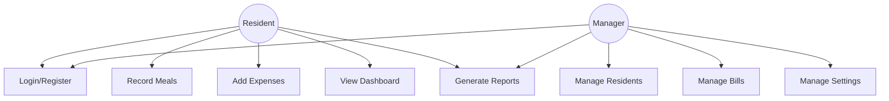
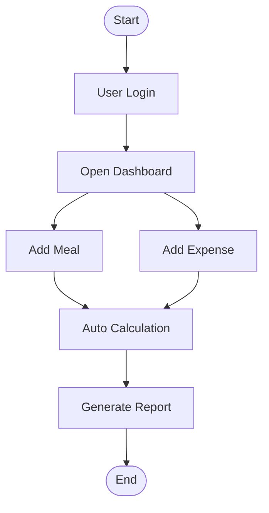
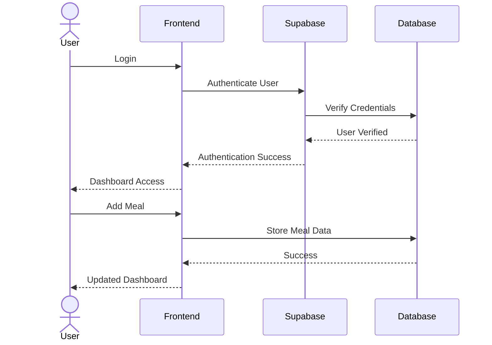
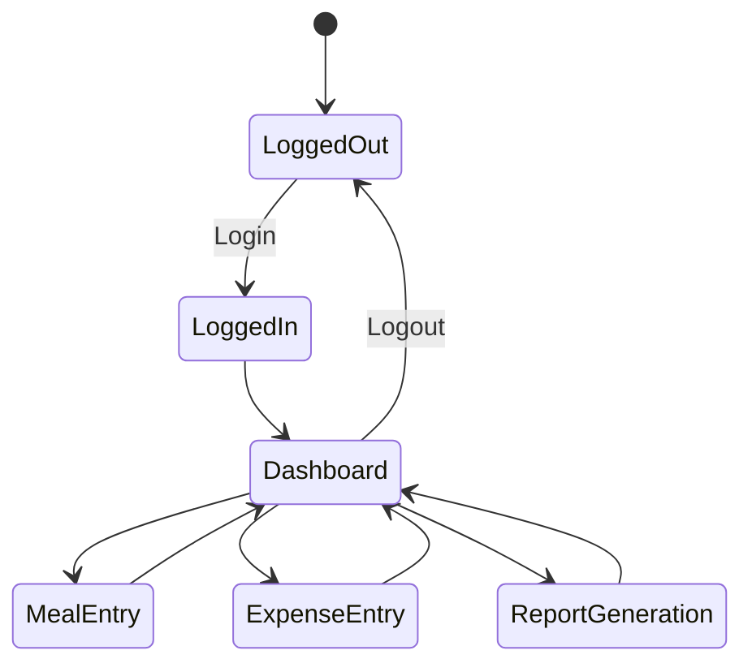
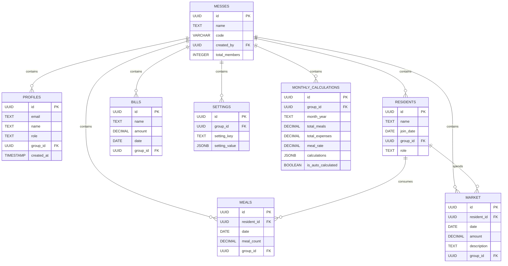

# Software Requirements Specification (SRS)

# MessMate – Hostel Management System

---

# Preface

This document presents the Software Requirements Specification (SRS) for **MessMate**, a modern hostel and mess management system developed to simplify shared living expense management among students and hostel residents.

The document describes the system architecture, functional and non-functional requirements, database structure, user interactions, system models, constraints, and future scalability considerations necessary for the successful development and deployment of the system.

---

# Version History

| Version | Description | Date |
|---|---|---|
| 1.0 | Initial Draft | 2026 |
| 1.1 | Added Functional & Non-Functional Requirements | 2026 |
| 1.2 | Added System Models and Database Design | 2026 |
| 1.3 | Final SRS Documentation | 2026 |

---

# 1. Introduction

## 1.1 Purpose

MessMate is a web-based hostel management application designed to simplify meal tracking, shared expense management, and monthly financial calculations for student hostels and mess environments.

The system provides a centralized platform where managers and residents can efficiently manage meals, market expenses, utility bills, and financial balances with automated calculations and reporting features.

The primary goal of MessMate is to reduce manual calculations, improve transparency, and automate hostel financial management processes.

---

## 1.2 Document Conventions

This document follows IEEE SRS documentation conventions.

| Keyword | Meaning |
|---|---|
| Must | Mandatory system requirement |
| Should | Recommended feature |
| May | Optional enhancement |

---

## 1.3 Intended Audience and Reading Suggestions

This document is intended for:

- Developers
- Project Supervisors
- QA/Test Engineers
- Future Contributors
- Academic Evaluators
- Stakeholders

---

## 1.4 Scope

MessMate provides the following core functionalities:

- User Authentication
- Mess Group Management
- Resident Management
- Daily Meal Tracking
- Shared Market Expense Logging
- Utility Bill Tracking
- Automatic Monthly Calculations
- Dashboard Analytics
- PDF Report Generation
- Role-Based Access Control
- Cloud Database Management

The application is designed primarily for student hostels and shared mess environments.

---

## 1.5 References

- IEEE Standard 830-1998
- Supabase Documentation
- React Documentation
- TypeScript Documentation
- Tailwind CSS Documentation

---

# 2. Overall Description

## 2.1 Product Perspective

MessMate is a standalone cloud-based web application.

The system architecture consists of:

- Frontend Client Application
- Supabase Backend Services
- Authentication System
- PostgreSQL Database
- Real-time Data Synchronization

The system supports multi-user access and real-time financial management.

---

## 2.2 Product Functions

### Dashboard Management
- View total meals
- View total expenses
- View monthly balance
- View meal rate

### Authentication System
- User registration
- Secure login/logout
- Google authentication
- Role-based authorization

### Mess Group Management
- Create mess groups
- Join mess groups
- Manage mess settings

### Resident Management
- Add residents
- Remove residents
- Track resident information

### Meal Management
- Record daily meals
- Update meal counts
- Track meal history

### Expense Management
- Add market expenses
- Track utility bills
- Categorize shared expenses

### Automatic Calculations
- Calculate meal rates
- Generate monthly balances
- Calculate total expenses automatically

### Reporting
- Generate monthly financial reports
- Download PDF summaries

---

## 2.3 User Classes and Characteristics

| User Class | Description |
|---|---|
| Manager | Full control over mess operations |
| User/Resident | View and update personal data |

---

## 2.4 Operating Environment

### Frontend
- React
- TypeScript
- Vite
- Tailwind CSS

### Backend
- Supabase
- PostgreSQL

### Browser Support
- Google Chrome
- Mozilla Firefox
- Microsoft Edge

### Hosting Environment
- Cloud-based deployment

---

## 2.5 Design and Implementation Constraints

- Internet connection required
- Dependency on Supabase infrastructure
- Browser compatibility constraints
- Secure authentication mandatory

---

## 2.6 Assumptions and Dependencies

- Users possess internet access
- Users understand basic web application usage
- Cloud services remain available

---

# 3. System Requirements Specification

# 3.1 Functional Requirements

---

## 3.1.1 Authentication

- The system must allow users to register.
- The system must support secure login and logout.
- The system must support Google authentication.
- The system must implement role-based authorization.

---

## 3.1.2 Profile Management

- Users must be able to manage profiles.
- Users must be assigned to mess groups.
- Users must have roles (user/manager).

---

## 3.1.3 Mess Management

- Managers must be able to create mess groups.
- Users must be able to join mess groups using codes.
- Managers must be able to update mess settings.

---

## 3.1.4 Resident Management

- Managers must be able to add residents.
- Managers must be able to remove residents.
- Resident records must be stored securely.

---

## 3.1.5 Meal Management

- Users must be able to record meals.
- Meal records must support date-based tracking.
- Meal updates must reflect automatically.

---

## 3.1.6 Market Expense Management

- Users must be able to add market expenses.
- Expenses must include descriptions and amounts.
- Expense history must be maintained.

---

## 3.1.7 Bill Management

- Users must be able to add utility bills.
- Bills must support monthly tracking.

---

## 3.1.8 Monthly Calculation System

- The system must automatically calculate:
  - Total meals
  - Total expenses
  - Meal rate
  - Individual balances

- Monthly calculations must be stored.

---

## 3.1.9 Settings Management

- Managers must be able to configure mess settings.
- Currency and timezone settings must be supported.

---

## 3.1.10 PDF Report Generation

- Users must be able to generate PDF reports.
- Reports must include:
  - Meal summaries
  - Expense summaries
  - Balance calculations

---

# 3.2 Non-Functional Requirements

---

## Performance Requirements

- The system should support concurrent users.
- Data retrieval should be optimized.
- Monthly calculations should execute efficiently.

---

## Security Requirements

- Row Level Security (RLS) must be implemented.
- Authentication must be secure.
- User data must be protected.

---

## Usability Requirements

- The UI should be responsive.
- Navigation should be user-friendly.
- The application should support mobile responsiveness.

---

## Reliability Requirements

- The system should maintain high availability.
- Data integrity must be preserved.

---

## Maintainability Requirements

- The project should support modular development.
- Database schema should be scalable.

---

## Portability Requirements

- The application should run on:
  - Windows
  - Linux
  - macOS

---

# 4. System Models

# 4.1 Context Diagram

---

# 4.2 Use Case Diagram

---

# 4.3 Activity Diagram

---

# 4.4 Sequence Diagram

---

# 4.5 State Diagram

---

# 4.6 Entity Relationship Diagram (ER Diagram)

---

# 5. Database Design

## Tables

| Table Name | Purpose |
|---|---|
| profiles | User profiles |
| messes | Mess groups |
| residents | Resident records |
| meals | Daily meal records |
| market | Shared expenses |
| bills | Utility bills |
| settings | Mess settings |
| monthly_calculations | Auto-generated calculations |

---

# 6. Security Features

- Supabase Authentication
- Row Level Security (RLS)
- Secure Policies
- Role-Based Access Control
- Protected Database Queries

---

# 7. System Evolution

## Future Improvements

- Mobile Application
- AI-based expense prediction
- Online payment integration
- Notification system
- Multi-hostel support
- Analytics dashboard

---

# 8. Appendices

# Hardware Requirements

- Internet-connected device
- Cloud server infrastructure

---

# Software Requirements

| Software | Purpose |
|---|---|
| Node.js | Runtime Environment |
| VS Code | Development |
| Supabase | Backend Services |
| GitHub | Version Control |

---

# Browser Requirements

- Google Chrome
- Mozilla Firefox
- Microsoft Edge

---

# Conclusion

MessMate is designed to modernize hostel and mess management through automation, transparency, and efficient financial tracking.

The system minimizes manual calculations, improves accountability, and provides a scalable solution for hostel meal and expense management.
